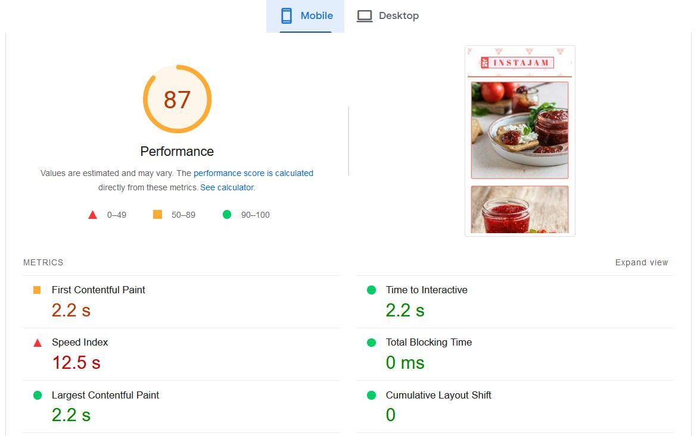
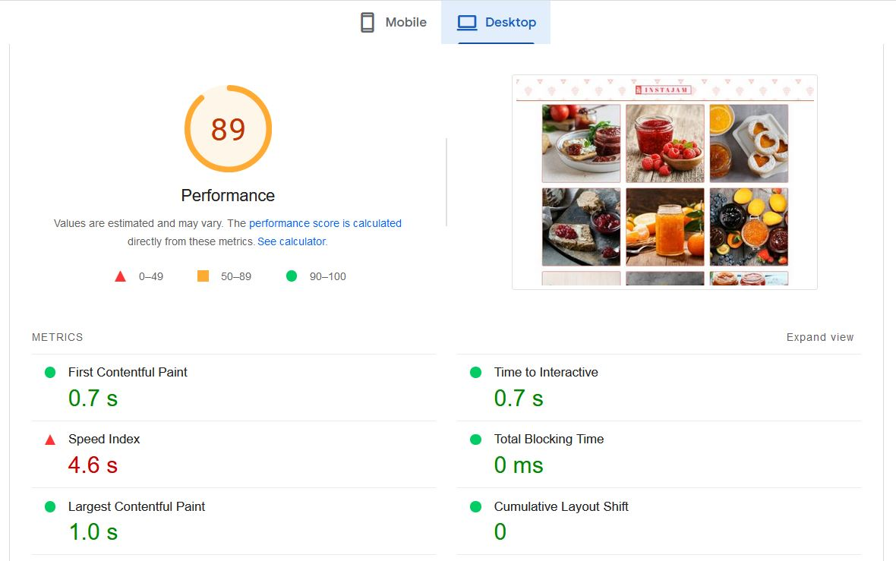

# jamster
Challenge task for responsive themeing




# Feedback on tests and optimizations
- js and css are used in minified version to increase site load speed
- images are loading on user interaction to optimize for google seo
- using nginx server for fast request handling and providing boost to wordpress sites
- seo url are handled through nginx site configuration (for example: tag/holidayjam)
- images thumbnails are optimized using wordpress crop functionality
- further images are compressed/optimized for seo using imagemagick batch convert commandline
- .htaccess is not provided considering production server be nginx
- have tested site on google chrome, mozzilla firefox and microsoft edge browsers
- have tested site on mobile chrome browser and uc browser ( loads instantly )
- google pagespeed score for mobile version is: 87 ( it is down because my server is behind proxy server )
- google pagespeed score for desktop version is: 89 ( it is down because my server is behind proxy server )

# How to run this code
1. Clone the repository in www directory of your server

2. Import the database-dump.sql to your database server

3. By default server url is: http://localhost, you can update it using following query
```
    update instajam_options set option_value='your_server_url' where option_id in(1,2);
```
4. Update the wp-config.php with your server database credentials.

5. Load the url in any desktop or mobile browser
